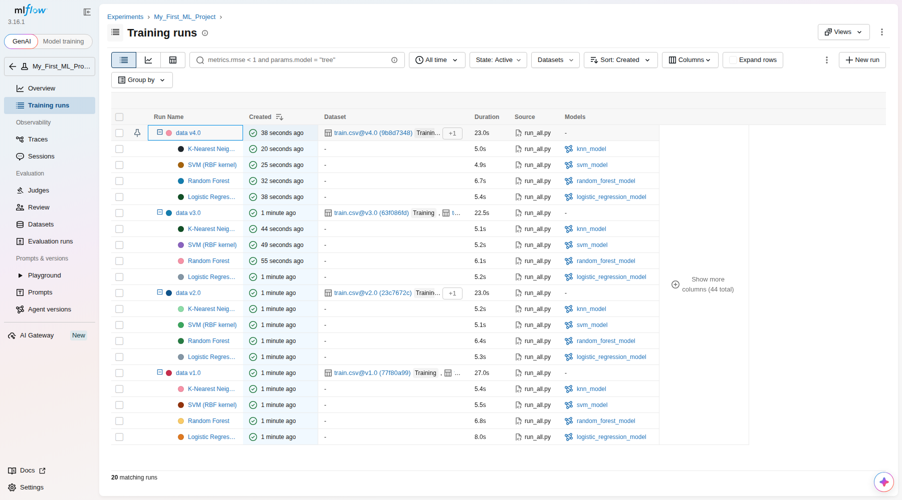
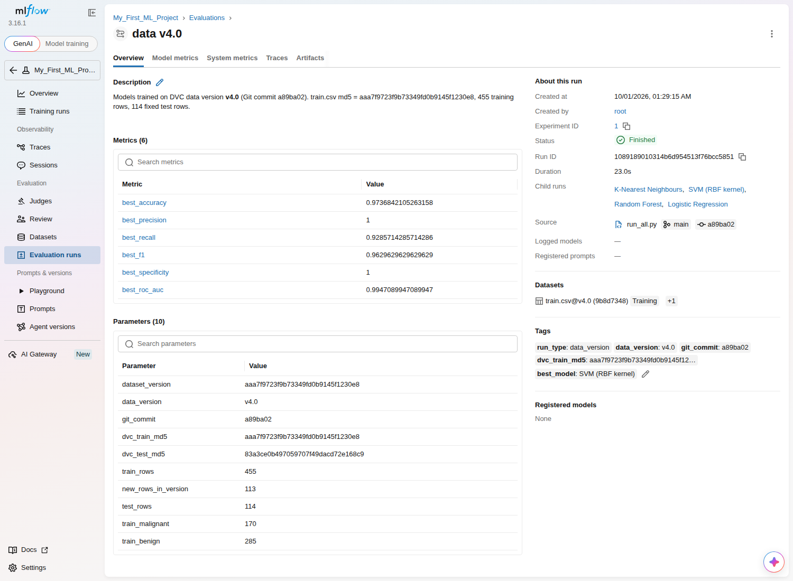
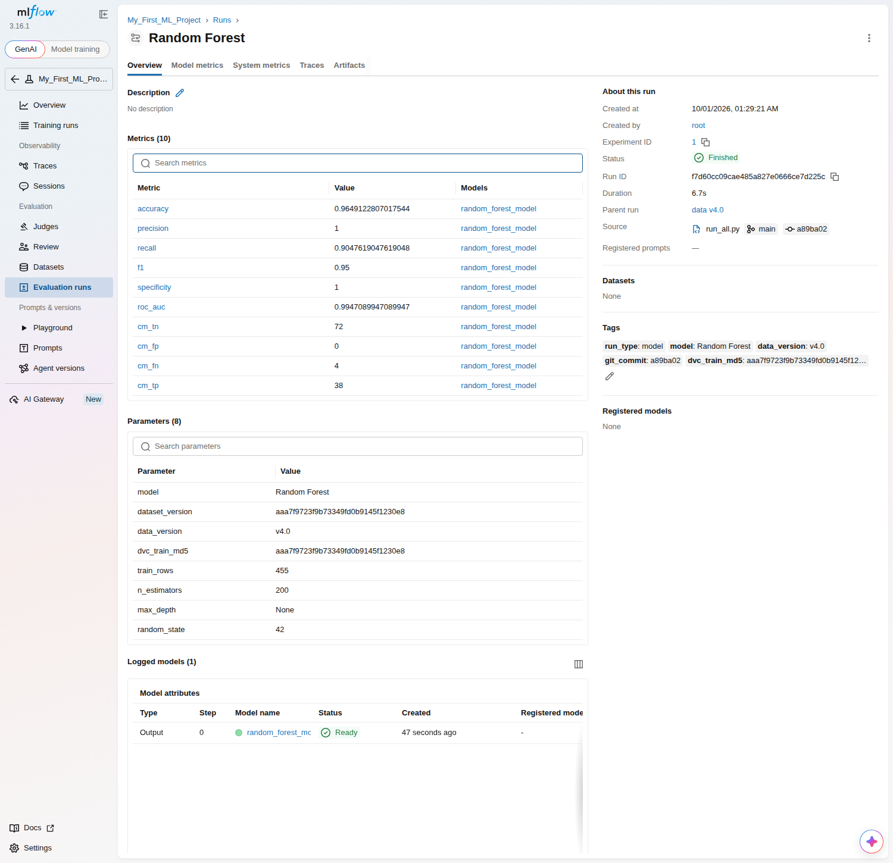
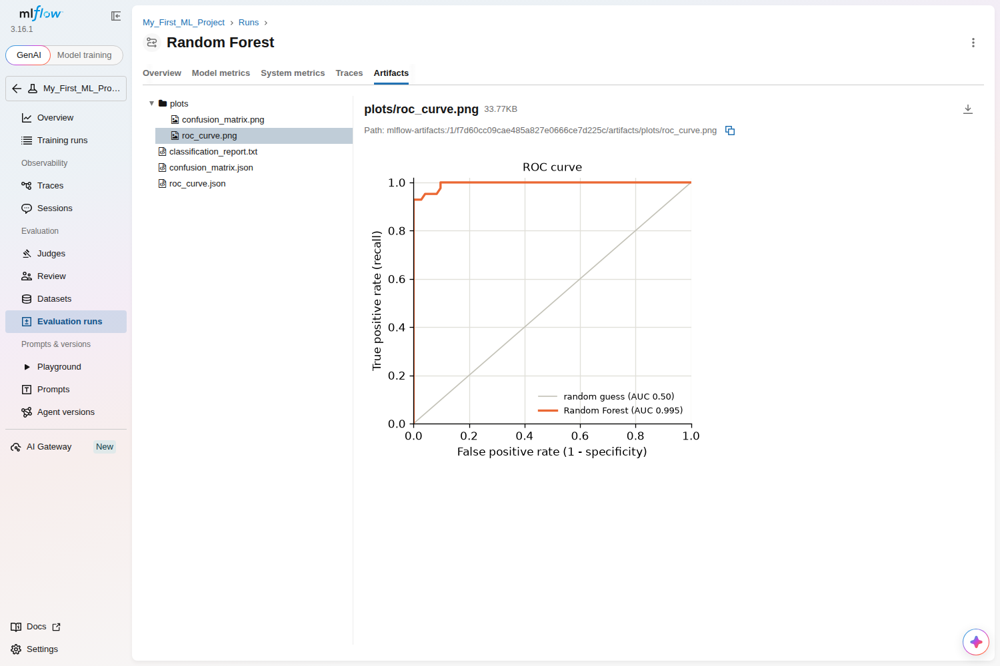
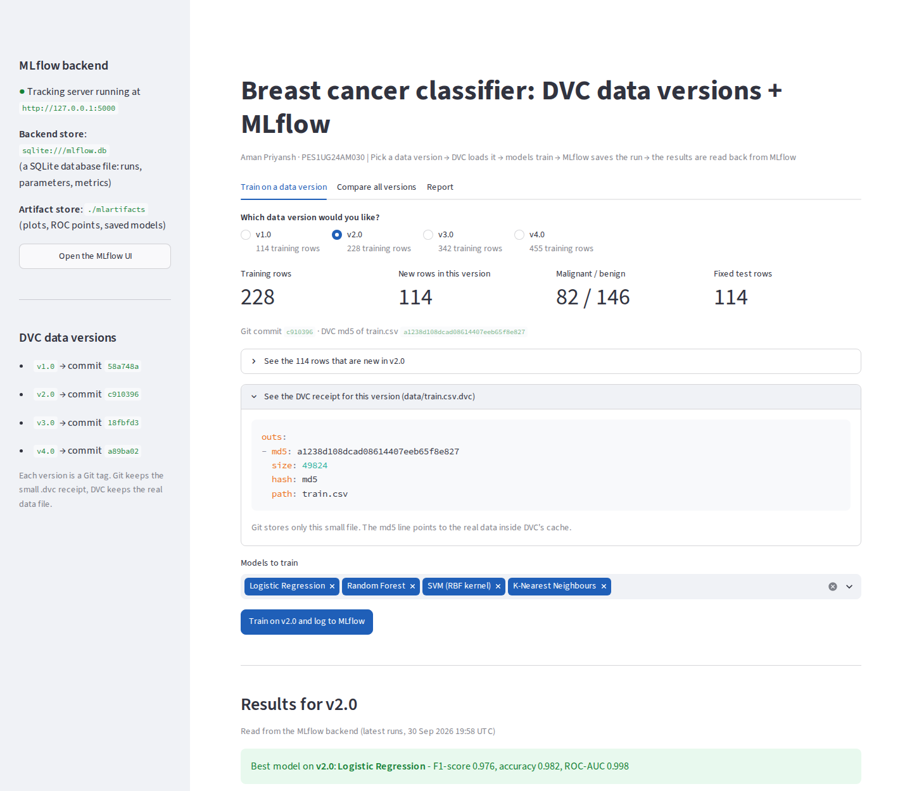
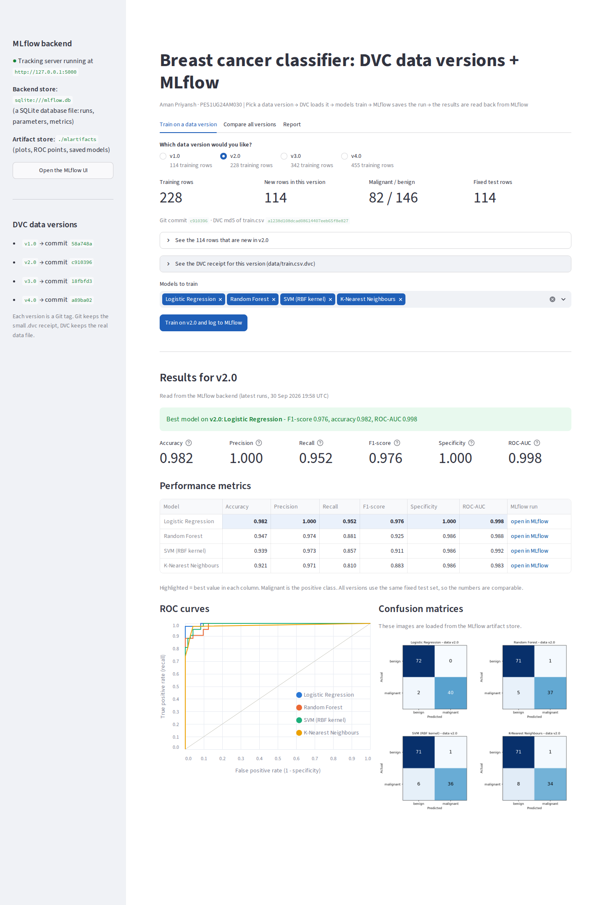
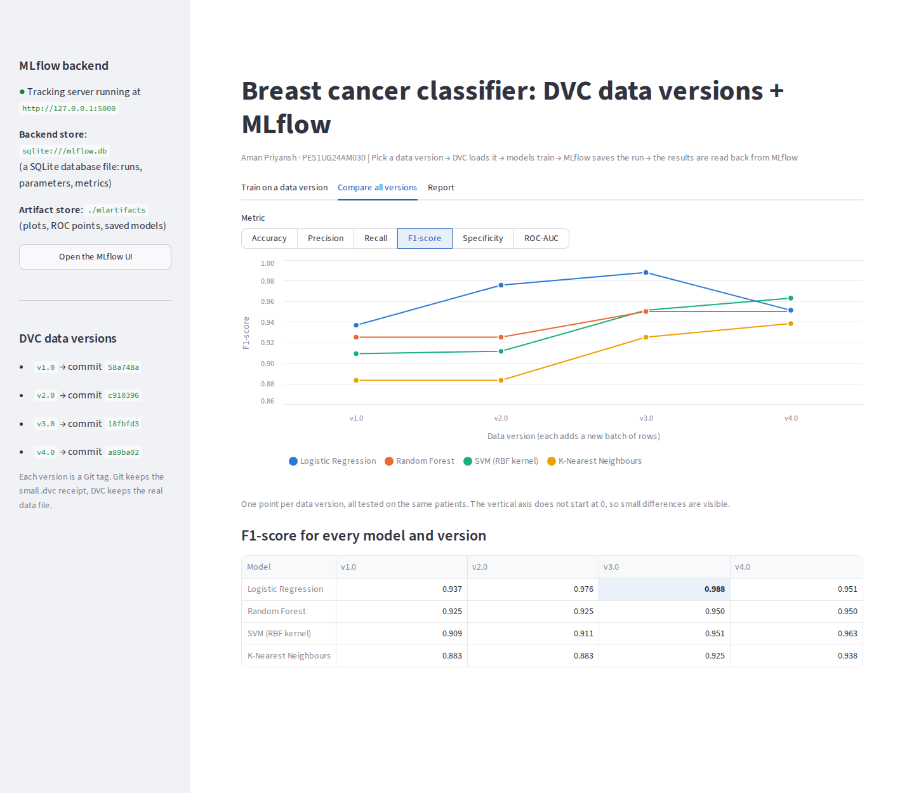

# DVC + MLflow integration: breast cancer classifier

Author: Aman Priyansh (PES1UG24AM030)

This repo does the **MLflow + DVC** task: DVC versions the dataset, MLflow tracks the
experiments, and every MLflow run records which DVC data version it was trained on.
On top of the task it adds 4 growing data versions, 4 models, a full set of performance
metrics, an MLflow tracking server with a SQLite backend store, and a GUI.

Related practice repos: [dvc-practice](https://github.com/AMAN-PRIYANSH/dvc-practice) ·
[mlflow-practice](https://github.com/AMAN-PRIYANSH/mlflow-practice)

## The task, step by step

| The document asks | Where it is done here |
|---|---|
| `git init`, `dvc init` | `run_all.py` step 1 |
| Track the dataset with `dvc add`, commit the `.dvc` file to Git | `run_all.py` step 2 (`data/train.csv.dvc`, `data/test.csv.dvc`) |
| `mlflow.set_experiment("My_First_ML_Project")` | `train.py` (name set in `config.py`) |
| Log the DVC data hash as `dataset_version` | `train.py` logs the md5 hash from `data/train.csv.dvc` as `dataset_version` |
| Log `n_estimators`, log `accuracy` | `train.py` (Random Forest, 200 trees) |
| `mlflow.sklearn.log_model(model, "random_forest_model")` | `train.py` |
| `mlflow ui` | MLflow tracking server at http://127.0.0.1:5000 |

One fix: the document uses `dvc hash data/train.csv`, but DVC has no `hash` command, so
that line would crash. The same md5 hash is read from the `.dvc` file instead.

## What was added on top

**1. Four data versions (DVC).** `data/train.csv` grows in batches. Each version keeps the
old rows and adds new ones:

| Version (Git tag) | Training rows | New rows |
|---|---|---|
| v1.0 | 114 | +114 |
| v2.0 | 228 | +114 |
| v3.0 | 342 | +114 |
| v4.0 | 455 | +113 |

`data/test.csv` (114 patients) is the same in every version, so the versions are compared
fairly. The data of every version is also pushed to a DVC remote (`dvc_storage/`), so a
fresh clone can get it back with `dvc pull`.

**2. Four models per version**, 16 model runs in total, grouped in MLflow under one parent
run per data version: Logistic Regression, Random Forest, SVM (RBF kernel), K-Nearest
Neighbours.

**3. Performance metrics** for every run: accuracy, precision, recall, F1-score,
specificity, ROC-AUC, the confusion matrix, and the ROC curve.

**4. MLflow tracking server.** Backend store = SQLite database `mlflow.db` (runs,
parameters, metrics). Artifact store = `mlartifacts/` (plots and saved models).

**5. GUI** (`app.py`, Streamlit). It asks "Which data version would you like?", gets that
version from DVC, trains, logs to MLflow, and shows the results read back from MLflow.

**6. Report** ([docs/report.html](docs/report.html)): the same results as one web page.

## Results (newest data, v4.0, same 114-patient test set)

| Model | Accuracy | Precision | Recall | F1 | Specificity | ROC-AUC |
|---|---|---|---|---|---|---|
| Logistic Regression | 0.965 | 0.975 | 0.929 | 0.951 | 0.986 | 0.996 |
| Random Forest | 0.965 | 1.000 | 0.905 | 0.950 | 1.000 | 0.995 |
| SVM (RBF kernel) | 0.974 | 1.000 | 0.929 | 0.963 | 1.000 | 0.995 |
| K-Nearest Neighbours | 0.956 | 0.974 | 0.905 | 0.938 | 0.986 | 0.982 |

F1-score as the data grows:

| Model | v1.0 | v2.0 | v3.0 | v4.0 |
|---|---|---|---|---|
| Logistic Regression | 0.937 | 0.976 | 0.988 | 0.951 |
| Random Forest | 0.925 | 0.925 | 0.950 | 0.950 |
| SVM (RBF kernel) | 0.909 | 0.911 | 0.951 | 0.963 |
| K-Nearest Neighbours | 0.883 | 0.883 | 0.925 | 0.938 |

More data helps most models. The scores do not always go up: one test patient is worth
0.9 percentage points of accuracy, so small ups and downs are normal.

## Screenshots

MLflow: one parent run per data version, 4 model runs inside each



A parent run: the DVC data version (hash, Git commit, rows) and the dataset



A model run: `dataset_version`, `n_estimators`, all metrics, `random_forest_model`



The ROC curve saved as an artifact



GUI: choose a data version (with its DVC receipt)



GUI: results for the chosen version



GUI: how the scores change across versions



## How to run it

You need Python 3.10+ and Git.

```
git clone https://github.com/AMAN-PRIYANSH/dvc-mlflow-integration.git
cd dvc-mlflow-integration
pip install -r requirements.txt
dvc pull                    # get the newest data from the DVC remote
dvc fetch --all-tags        # get every older data version too
python run_all.py           # start MLflow, train on every version, build the report
streamlit run app.py        # the GUI, at http://localhost:8501
```

On Windows you can double-click `setup.bat` once and then `start_gui.bat`.

Other useful commands:

```
python train.py --version v2.0     # train again on one data version
python report.py                   # rebuild the report from MLflow
python mlflow_server.py            # start only the MLflow server + UI (http://127.0.0.1:5000)
git log --oneline --decorate       # the data versions as Git history
git checkout v1.0                  # go back to data version 1 ...
dvc checkout                       # ... and let DVC swap the data file
git checkout main
dvc checkout                       # back to the newest version
```

## What each file does

| File | Job |
|---|---|
| `prepare_data.py` | makes train.csv for version 1..4, and the fixed test.csv |
| `data_versions.py` | asks Git for the `.dvc` receipt and DVC for the data of a version |
| `mlflow_server.py` | starts the MLflow tracking server (SQLite backend store) |
| `train.py` | trains the 4 models on one version and logs everything to MLflow |
| `report.py` + `report_template.html` | build the report from the MLflow runs |
| `app.py` | the GUI (Streamlit) |
| `run_all.py` | runs every step above in order |
| `config.py` | all settings in one place |

## Dataset

Breast Cancer Wisconsin (Diagnostic): 569 patients, 30 measurements each, labelled malignant
or benign. It ships with scikit-learn, so no download is needed. The batches of v1..v4
simulate new patient data arriving over time.
